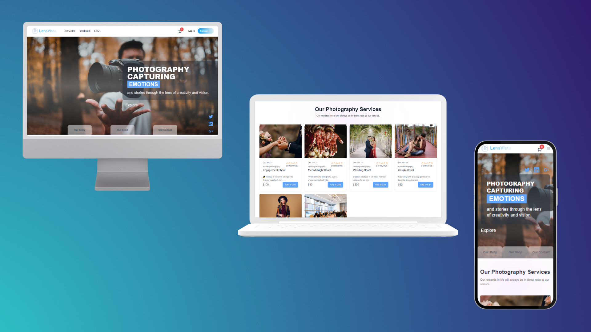

[](https://choosealicense.com/licenses/mit/)
[](https://opensource.org/licenses/)
[](http://www.gnu.org/licenses/agpl-3.0)


# Lens Vista

LensVista skillfully captures moments! 📸 We specialize in providing expert photography services for events, portraits, and special occasions. 🌟 Allow us to elegantly frame your cherished memories. #PreserveMoments

# Demo



<!-- Table of Contents -->
<details>

<summary>

# :notebook_with_decorative_cover: Table of Contents

</summary>

- [Role based](#role_based)
- [Entity Relationship Diagram(ERD)](#entity-relationship-diagram(erd))
- [Project Features](#project_features)
- [API Endpoints](#api_endpoints)
- [Tech Stack](#tech_stack)
- [Authors](#authors)

</details>

# Role_based

| Role                | Credential
|-----------------------------------------|------------------------------------------------------|
| Admin               | Email: admin@gmail.com password: ********
| User                | Email: user@gmail.com password: 123456

# Entity-Relationship-Diagram(ERD)

```

+----------------+       +---------------+      +---------------+      +------------+
|      User      |       |    Booking    |      |    Service    |      |   Review   |
+----------------+       +---------------+      +---------------+      +------------+
| id: Int        |       | id: Int       |      | id: Int       |      | id: Int    |
| role: String   |1      | userId: Int   |      | title: String |      | userId: Int|
| name: String   |-------| serviceId: Int|      | banner: Str   |------| serviceId: |
| email: String  |       | bookingInfo: J|      | isBooked: Boo |      | message: St|
| password: Str  |       | status: Str   |      | description:  |      | rating: Str|
| location: Str? |       | createdAt: Dat|      | category: Str |      | createdAt: |
| phone: Str?    |       | updatedAt: Dat|      | price: Float  |      | updatedAt: |
| profileImage: S|       +---------------+      | availabilit: B|      +------------+
| createdAt: Dat |                              | createdAt: Dat|
| updatedAt: Dat |                              | updatedAt: Dat|
+----------------+                              +---------------+
         |                                                |
         |                                                |
         v                                                v
+----------------+                               +----------------+
|   Feedback     |                               |      FAQ       |
+----------------+                               +----------------+
| id: Int        |                               | id: Int        |
| email: String  |                               | title: String  |
| message: Str   |                               | content: String|
| createdAt: Dat |                               | createdAt: Dat |
| updatedAt: Dat |                               | updatedAt: Dat |
+----------------+                               +----------------+
         |
         v
+----------------+
|      News      |
+----------------+
| id: Int        |
| title: String  |
| content: String|
| contentType: S |
| banner: String?|
| createdAt: Dat |
| updatedAt: Dat |
+----------------+
```

# Project_Features

## User Management

- **User Authentication:** Secure user authentication for creating accounts and logging in.

- **User Profile Management:** Users can easily manage their profiles, including personal information and preferences.

## Event Booking

- **Event Booking System:** Users can book events seamlessly, providing a convenient way to participate in various activities.

- **Booking Tracking:** Users have the ability to track and manage their booked events in one central location.

- **Event Reviews:** Users can leave reviews for events they attended, contributing to a feedback system.

## Admin Panel

- **Admin Profile Management:** Admins have control over their profiles, ensuring accurate and up-to-date information.

- **Event Management:**
  - Create New Event: Admins can add new events to the system.
  - Update Existing Event: Modify details of existing events.
  - Delete Event: Remove outdated or canceled events from the platform.

- **Customer Booking Management:**
  - Accept Bookings: Admins can approve customer bookings.
  - Cancel Bookings: Admins have the ability to cancel bookings as necessary.

- **News and FAQ Management:**
  - News Updates: Admins can post and manage news updates.
  - FAQ Management: Admins can add, edit, or remove frequently asked questions.

# API_Endpoints

## Main Route

# Authentication Routes 🛡️
- **POST /auth/register:** Register a new user.
- **POST /auth/login:** Log in a user.

# User Routes
- **GET /user/all-users:** Retrieve all users. Requires ADMIN or SUPER_ADMIN privileges..
- **GET /user/me:** Retrieve own user profile.
- **GET /user/admins:** Retrieve all administrators. Requires SUPER_ADMIN privileges.
- **POST /user/update-profile:** Update an own profile information.
- **PATCH /user/admin/update-role/:email:** Update the role of an administrator by email. Requires SUPER_ADMIN privileges.
- **PATCH /user/:id:** Update user information by ID. Requires ADMIN or SUPER_ADMIN privileges.
- **POST /user/update-profile-data:** Update profile data. Requires validation.
- **DELETE /user/:id:** Delete a user by ID. Requires ADMIN or SUPER_ADMIN privileges.

# Service Routes
- **POST /service/create:** Create a new service.
- **GET /service/best-services:** Retrieve the best services.
- **GET /service/:id:** Retrieve details of a single service by ID.
- **GET /service/:** Retrieve all services.
- **DELETE /service/:id:** Delete a service by ID. 🗑️
- **PATCH /service/:id:** Update information for a specific service. 🔄

# News Routes 📰

- **POST /news:** Create a new news article. ✏️
- **GET /news:** Get all news articles. 📄
- **GET /news/:id:** Get details of a specific news article by ID. 📰
- **PATCH /news/:id:** Update details of a specific news article by ID. 🔄
- **DELETE /news/:id:** Delete a news article by ID. 🗑️

# Booking Routes
- **POST /bookings/:** Create a new booking.
- **GET /bookings/all-bookings:** Get all bookings (Admin access required).
- **PATCH /bookings/cancel-booking/:id:** Cancel a booking by ID (Admin access required).
- **PATCH /bookings/confirm-booking/:id:** Confirm a booking by ID (Admin access required).
- **DELETE /bookings/:id:** Delete a user booking by ID (User access required).
- **GET /bookings/:** Get user's bookings.

# FAQ Routes
- **POST /faq/:** Create a new FAQ. ✏️
- **GET /faq/:** Get all FAQs. 📄
- **DELETE /faq/:id:** Delete a FAQ by ID. 🗑️
- **PATCH /faq/:id:** Update a FAQ by ID. 🔄

# Feedback Routes 
- **POST /feedback:** Submit feedback.

# Review Routes
- **POST /reviews:** Create a new review. ✍️
- **GET /reviews/:id:** Get reviews by ID. 📄


# Tech_Stack

[](https://expressjs.com/ "Express JS") 
[](https://nodejs.org/en "Node JS") 
[](https://www.postgresql.org/ "Postgres")
[](https://prisma.io/ "Prisma")
[](https://supabase.com/ "Supabase")
[](https://www.typescriptlang.org/ "TypeScript")
[](https://vercel.com/ "Vercel")

# Authors

- [@ShuvoProgramer](https://github.com/ShuvoProgram)

<p align="right">(<a href="#readme-top">back to top</a>)</p>